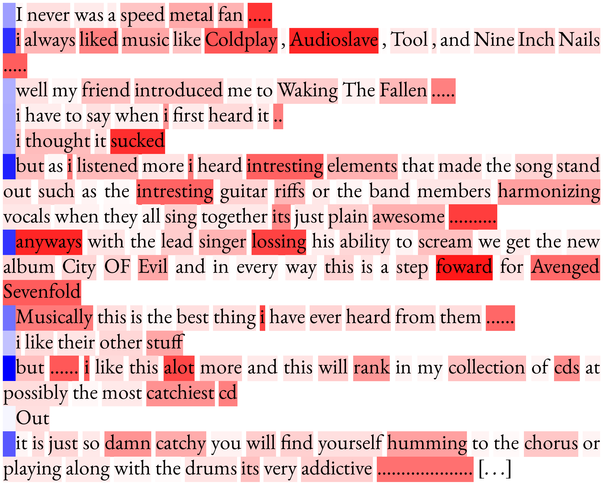
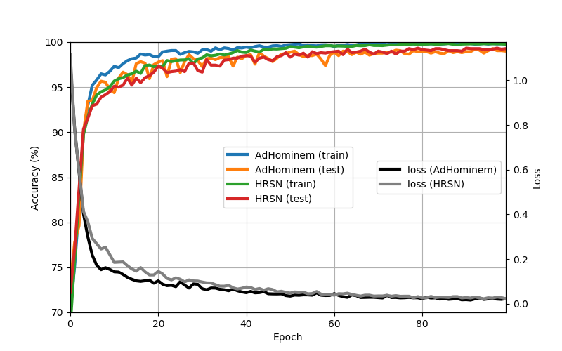

# AdHominem

This repository contains the source code used in our paper [_Explainable Authorship Verification in Social Media via Attention-based Similarity Learning_](https://arxiv.org/abs/1910.08144) published at [_2019 IEEE International Conference on Big Data (IEEE BigData 2019)_](http://bigdataieee.org/BigData2019/)

Please, feel free to send any comments or suggestions! (benedikt.boenninghoff[at]rub.de)

# Installation

We used Python 3.6 (Anaconda 3.6). The following libraries are required:

* Tensorflow 1.12.0
* spacy 2.1.8
* textacy 0.8.0
* fasttext 0.9.1
* numpy 1.15.4
* scipy 1.1.0
* pandas 0.23.4
* scikit-learn 0.20.0
* bs4 0.0.1

# Dataset

The large-scale dataset of short Amazon reviews used in our paper will be published as soon as possible. Currently, this repository works with a [_small Amazon review dataset_](https://github.com/marjanhs/prnn). You can download and uncompress the data as follows:

    mkdir data
    cd data
    wget https://github.com/marjanhs/prnn/raw/master/data/amazon.7z
    sudo apt-get install p7zip-full
    7z x amazon.7z

# Download pretrained word embeddings

We used [_pretrained word embeddings_](https://fasttext.cc/). You may prepare them as follows:
    
    cd data
    wget https://dl.fbaipublicfiles.com/fasttext/vectors-crawl/cc.en.300.bin.gz
    gunzip cc.en.300.bin.gz

# Data preprocessing
    
    cd preprocessing
    python main_preprocess.py

# Training
You can choose two Siamese network models: [_AdHominem_](https://arxiv.org/abs/1910.08144) or [_HRSN_](https://arxiv.org/abs/1908.07844):
    
    cd training
    python main.py --model_type "AdHominem"

# Cite the paper

If you use our code or data, please cite the papers using the following BibTeX entries:

    @inproceedings{Boenninghoff2019b,
    author={Benedikt Boenninghoff, Steffen Hessler, Dorothea Kolossa and Robert M. Nickel},
    title={Explainable Authorship Verification in Social Media via Attention-based Similarity Learning},
    booktitle={IEEE International Conference on Big Data (IEEE Big Data 2019), Los Angeles, CA, USA, December 9-12, 2019},
    year={2019},
    }

    @inproceedings{Boenninghoff2019a,
    author={Benedikt Boenninghoff, Robert M. Nickel, Steffen Zeiler and Dorothea Kolossa},
    booktitle={IEEE International Conference on Acoustics, Speech and Signal Processing (ICASSP 2019), Brighton, UK, May 12-17, 2019},
    title={Similarity Learning for Authorship Verification in Social Media},
    year={2019},
    pages={2457-2461},
    doi={10.1109/ICASSP.2019.8683405},
    }

